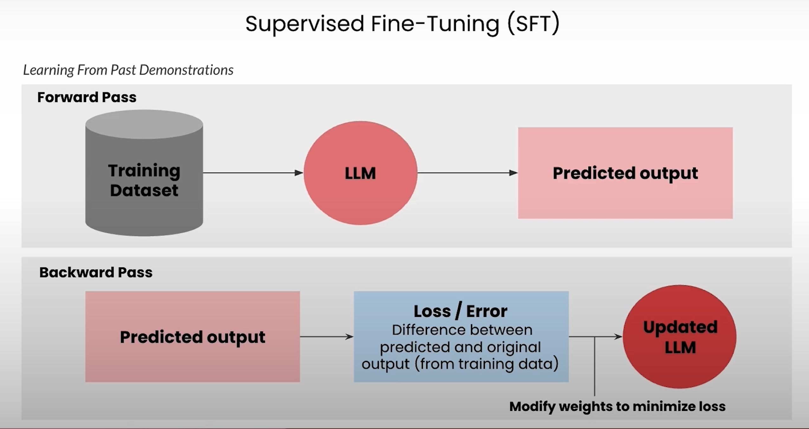
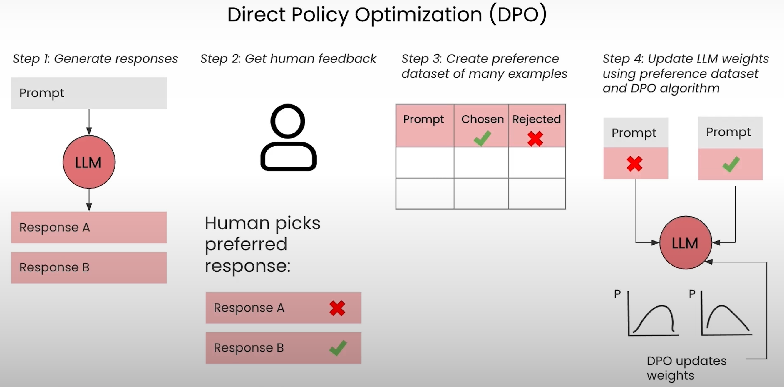
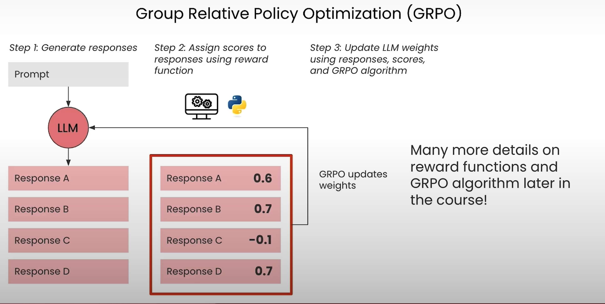
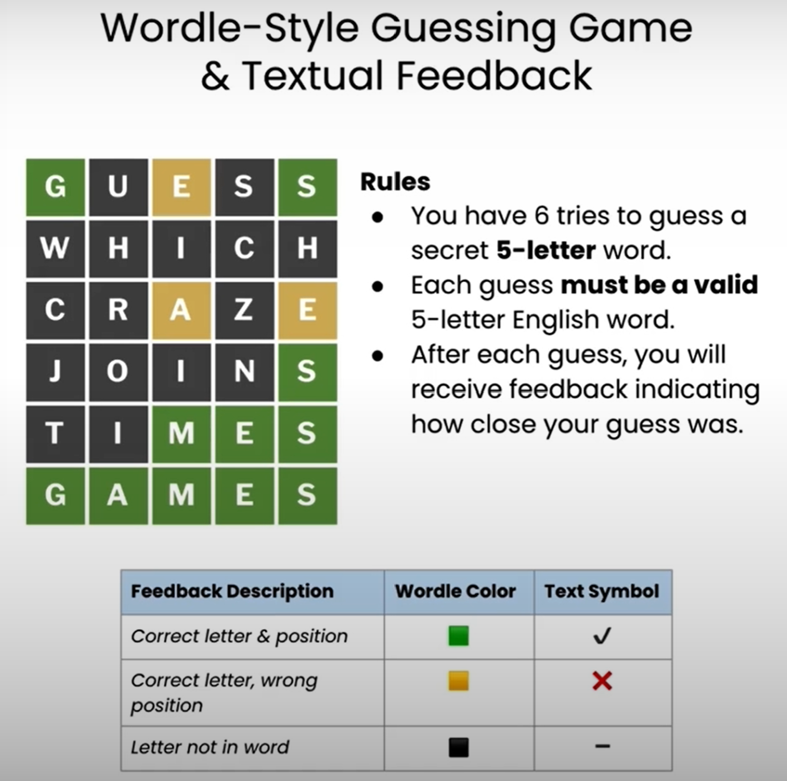
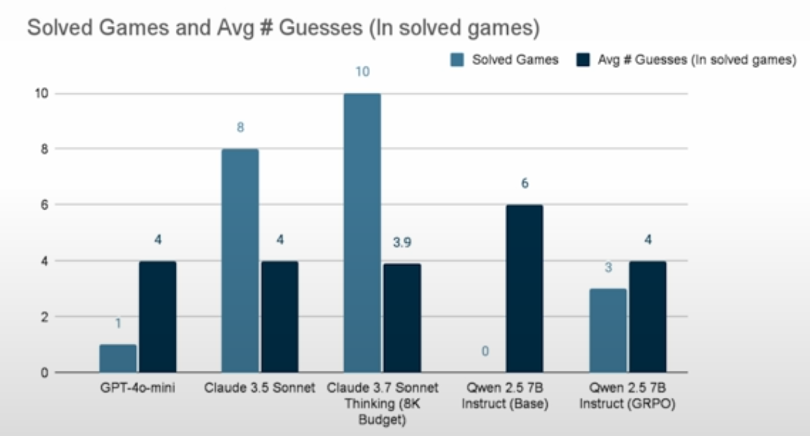

# 

This project explores the application of Reinforcement Fine-Tuning (RFT) using the Group Relative Policy Optimization (GRPO) algorithm to enhance the capabilities of Large Language Models (LLMs), particularly for tasks requiring complex reasoning or strategic decision-making. The methodology is demonstrated through a practical example involving fine-tuning the Qwen 2.5 7B Instruct model to play a [Wordle-style guessing game](https://en.wikipedia.org/wiki/Wordle).

## Introduction: Beyond Supervised Fine-Tuning

Supervised Fine-Tuning (SFT) is a common technique for adapting pre-trained LLMs to specific tasks. It involves training the model on a dataset of input-output examples, essentially teaching the model to mimic the provided demonstrations. SFT operates through a forward pass, where the LLM processes input from a training dataset to generate a predicted output, and a backward pass, where the difference (loss or error) between the predicted output and the ground truth output from the training data is calculated. This error is then used to modify the LLM's weights, minimizing the loss and improving its ability to replicate the desired outputs. While effective for many tasks, SFT relies heavily on the availability of high-quality demonstration data and primarily encourages imitation rather than exploration or strategic reasoning.

*Figure 1: Overview of the Supervised Fine-Tuning (SFT) process, involving forward and backward passes to minimize prediction error based on a training dataset.*

For tasks where optimal strategies are complex, involve multiple steps, or where high-quality demonstrations are scarce, alternative fine-tuning methods are often necessary. Reinforcement Learning from Human Feedback (RLHF) emerged as a powerful technique. RLHF typically involves generating multiple responses from the LLM, having humans rank these responses based on preference, training a separate reward model to predict these human preferences, and finally, using a reinforcement learning algorithm like Proximal Policy Optimization (PPO) to update the LLM's weights based on the reward model's scores. This allows the model to learn preferences and improve generation quality beyond simple imitation.

*Figure 2: The standard Reinforcement Learning from Human Feedback (RLHF) pipeline, incorporating human feedback to train a reward model and update the LLM using PPO.*

However, RLHF can be complex and resource-intensive, often requiring the training and maintenance of multiple models (the policy model, the reward model, and sometimes a critic model used within PPO). Direct Policy Optimization (DPO) offers a simpler alternative by directly optimizing the LLM policy using human preference data (chosen vs. rejected responses) without needing an explicit reward model. It generates responses, gathers human feedback on preferred responses, creates a preference dataset, and updates the LLM weights directly using this dataset and the DPO algorithm.

*Figure 3: The Direct Policy Optimization (DPO) approach, which bypasses the need for an explicit reward model by using preference data directly.*

## Reinforcement Fine-Tuning (RFT) and Group Relative Policy Optimization (GRPO)

Reinforcement Fine-Tuning (RFT) represents another approach, particularly suited for tasks where the outcomes are verifiable (e.g., solving a math problem, winning a game, passing unit tests) and where labeled ground-truth data might be limited. RFT allows the model to learn through trial and error, developing its own strategies rather than just mimicking examples. The decision framework below helps determine when RFT is most applicable compared to SFT or standard RLHF.

*Figure 4: A flowchart illustrating when to use SFT, RLHF, or RFT based on data availability, task verifiability, and the utility of reasoning.*

This project utilizes Group Relative Policy Optimization (GRPO), a specific RL algorithm tailored for RFT. GRPO aims to optimize the LLM policy by maximizing an objective function that considers the quality of generated responses. A key advantage of GRPO, as highlighted in the comparison with RLHF+PPO, is that it foregoes the need for a separate critic model (often used in PPO to estimate value functions). Instead, GRPO estimates the baseline reward using scores derived from groups of sampled outputs. This potentially reduces training costs and complexity.

*Figure 5: Comparison showing how RLHF+GRPO and RLVR+GRPO simplify the RLHF pipeline by removing the critic model, and in the case of RLVR, the reward model as well.*

The GRPO algorithm involves generating multiple responses, assigning scores using a reward function, and updating the LLM weights based on these responses, scores, and the GRPO optimization objective.

*Figure 6: A high-level overview of the GRPO process, involving response generation, scoring, and weight updates.*

The GRPO objective function involves several components, detailed mathematically below. It averages scores over multiple generated responses (outputs) and the steps within those responses. It calculates the ratio of probabilities between the new policy (being trained) and the old policy for each step. This ratio is then clipped to prevent excessively large updates. The clipped ratio is multiplied by an advantage estimate (Â), which reflects the quality of each step relative to a baseline, computed using rewards obtained from the group of outputs. Finally, a Kullback–Leibler (KL) divergence term is included, acting as a regularizer to ensure the updated policy does not deviate too drastically from a reference policy (often the original SFT policy), maintaining stability.

*Figure 7: The mathematical formulation of the GRPO algorithm as presented by Guo et al. 2025.*

*Figure 8: A visual breakdown of the components within the GRPO objective function, explaining terms like probability ratios, clipping, advantage estimation, and KL divergence.*

## Methodology: SFT followed by RFT with GRPO for Wordle

The fine-tuning process implemented in this project follows a two-step approach, combining the strengths of SFT and RFT:

1.  **Supervised Fine-Tuning (SFT):** The initial step involves performing SFT on the base LLM (Qwen 2.5 7B Instruct). A specialized dataset, referred to as a Reasoning Trace Dataset (potentially generated using a capable model like Claude, based on 35 example games), is used. This SFT phase trains the model to imitate good reasoning patterns observed in the dataset, resulting in an SFT Model Checkpoint.

2.  **Reinforcement Fine-Tuning (RFT) with GRPO:** The SFT Model Checkpoint serves as the starting point for the RFT phase. The model is prompted with simulated Wordle scenarios, including game state feedback. It generates multiple candidate responses (e.g., 16 completions or guesses). These responses are evaluated using predefined reward functions to calculate rewards and advantages. Examples of reward functions relevant to the Wordle task include checking the output format, assessing whether the guess utilizes feedback from previous turns correctly, and evaluating the intrinsic value or quality of the guess itself. The GRPO algorithm then uses these rewards and advantages, along with techniques like clipping and KL-divergence regularization, to update the model's weights, producing the final GRPO Model Checkpoint. This RFT step aims to improve the model's strategic guessing ability and convergence speed beyond what SFT alone achieves.

*Figure 9: The two-step fine-tuning pipeline combining SFT with a Reasoning Trace Dataset and RFT using GRPO with simulated Wordle prompts and feedback.*

## Application: Wordle-Style Guessing Game

The effectiveness of the SFT+GRPO approach is demonstrated on a Wordle-style guessing game. The rules are standard: guess a secret 5-letter English word within 6 tries. Each guess must be a valid 5-letter word. Feedback is provided after each guess, indicating correct letters in the correct position (green/tick), correct letters in the wrong position (yellow/cross), and letters not present in the word (black/dash). The LLM is prompted with the game state, including rules, previous guesses, and feedback, and is tasked with generating the next guess. The reward functions are designed to encourage valid, informative guesses that leverage the feedback effectively.

*Figure 10: Explanation of the Wordle-style game rules and the feedback mechanism used in this project.*

The specific RFT setup for the Wordle task involves building prompts combining system instructions (rules, feedback format, examples) and user context (previous guesses, feedback, instructions), prompting the Qwen 2.5 7B model, generating multiple responses, and scoring them using reward functions focused on output format, feedback utilization, and guess value.

*Figure 11: The specific application of RFT for the Wordle task, detailing prompt construction, response generation, and reward functions.*

## Code Structure

The `NoteBooks` folder contains a series of Jupyter notebooks (`SFT_GRPO_1.ipynb` through `SFT_GRPO_6.ipynb`) that walk through the implementation details of this project. These notebooks cover the following key topics in sequence:

1.  **Can a large language model master Wordle?** (`SFT_GRPO_1.ipynb`): Explores the baseline capabilities of LLMs on the Wordle task.
2.  **Reward functions** (`SFT_GRPO_2.ipynb`): Introduces and implements initial reward functions for evaluating Wordle guesses.
3.  **Reward functions with LLM as a judge** (`SFT_GRPO_3.ipynb`): Demonstrates using another LLM to act as a judge for evaluating guess quality, providing more nuanced rewards.
4.  **Reward hacking** (`SFT_GRPO_4.ipynb`): Discusses the potential issue of reward hacking, where the model exploits the reward function without genuinely improving, and explores mitigation techniques.
5.  **Calculating loss in GRPO** (`SFT_GRPO_5.ipynb`): Details the calculation of the GRPO loss function, incorporating the components discussed earlier (probability ratio, advantage, clipping, KL divergence).
6.  **Putting it all together: Training Wordle** (`SFT_GRPO_6.ipynb`): Integrates the preceding concepts to perform the actual SFT and RFT (using GRPO) training process for the Wordle-playing LLM.

## Results and Evaluation

Performance evaluation focuses on the number of Wordle games solved and the average number of guesses required in solved games. Comparisons are made between several models. The charts below summarize the key findings.

*Figure 12: Performance comparison showing solved games and average guesses, highlighting the result for Qwen 2.5 7B Instruct fine-tuned with GRPO only.*

*Figure 13: Performance comparison showing solved games and average guesses, highlighting the improved result for Qwen 2.5 7B Instruct fine-tuned with SFT followed by GRPO.*

The results indicate that the base Qwen 2.5 7B Instruct model solved 0 games. Fine-tuning solely with GRPO improved performance significantly, enabling the model to solve 3 games with an average of 4 guesses. The combined SFT+GRPO approach yielded the best results for the Qwen model, solving 7 games with an average of 4 guesses per solved game. This demonstrates the effectiveness of the two-stage fine-tuning process, where initial SFT provides a strong foundation based on reasoning traces, and subsequent RFT with GRPO further refines the model's strategic capabilities for the specific task.

## Conclusion

This project showcases the potential of combining SFT with RFT using the GRPO algorithm for enhancing LLM performance on complex, verifiable tasks like the Wordle game. By first grounding the model with SFT on reasoning examples and then refining its strategy through GRPO-based reinforcement learning, significant improvements in task success rate can be achieved compared to using the base model or GRPO alone. The GRPO algorithm itself presents an efficient alternative to traditional RLHF methods by eliminating the need for a separate critic model.

## References
1.  **Shao, Z., et al. (2024). DeepSeekMath: Pushing the Limits of Mathematical Reasoning in Open Language Models**. *arXiv preprint arXiv:2402.03300*.)
2.  **Serrano.Academy. (2025, May). GRPO - Group Relative Policy Optimization - How DeepSeek trains reasoning models.** YouTube.
    <https://www.youtube.com/watch?v=XeUB4h1OO1g&t=994s>
3.  **Zhang, T., et al. (2024). Reinforcement Learning Enhanced LLMs: A Survey.** *arXiv preprint arXiv:2412.10400.*
    <https://arxiv.org/html/2412.10400v1>
4.  **Zhao, Z., et al. (2025). Systems Opportunities for LLM Fine-Tuning using Reinforcement Learning.** *Proceedings of the ACM on Measurement and Analysis of Computing Systems.*
    <https://dl.acm.org/doi/10.1145/3721146.3721944>
5.  **Raschka, S. (2025, April 19). The State of Reinforcement Learning for LLM Reasoning.**
    <https://sebastianraschka.com/blog/2025/the-state-of-reinforcement-learning-for-llm-reasoning.html>
6.  **Predibase Documentation: Models.**
    <https://docs.predibase.com/user-guide/inference/models>
7.  **DeepLearning.AI. Reinforcement Fine-Tuning LLMs with GRPO.**
    <https://www.deeplearning.ai/short-courses/reinforcement-fine-tuning-llms-grpo/>
